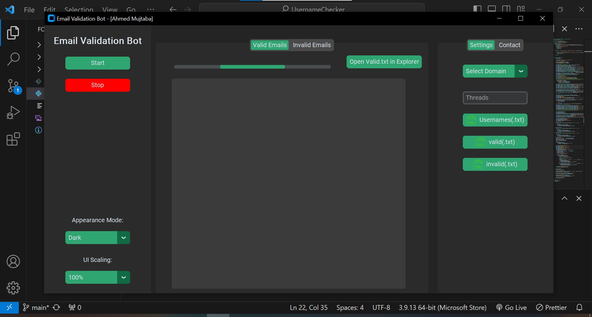

# GitHub Username Checker

GitHub Username Checker is a simple tool for verifying the existence of an email address.

## Features

- Check the validity of an email address.

## Usage

1. Clone this repository.
2. Run the `app.py` file.
3. Enter the email address you want to check.
4. Click the "Check" button.

